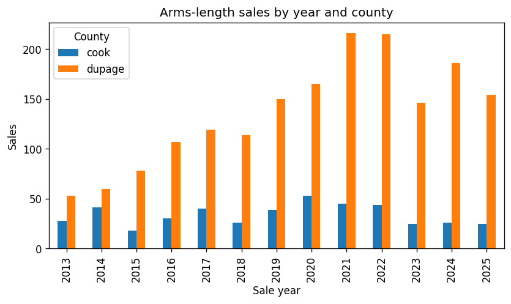
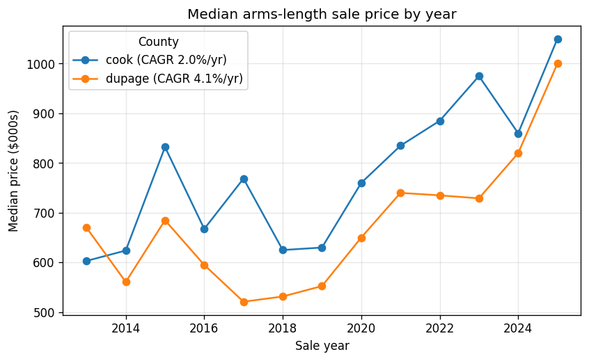
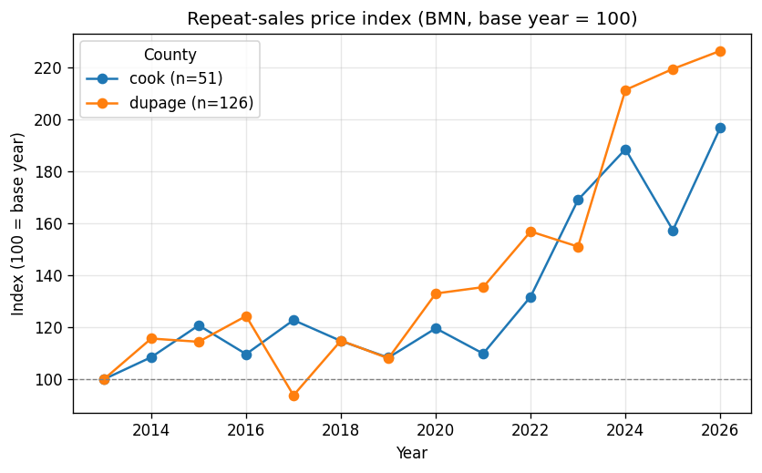
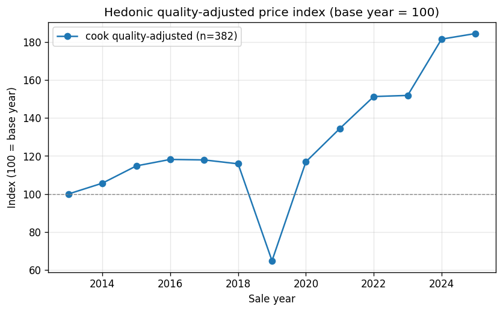
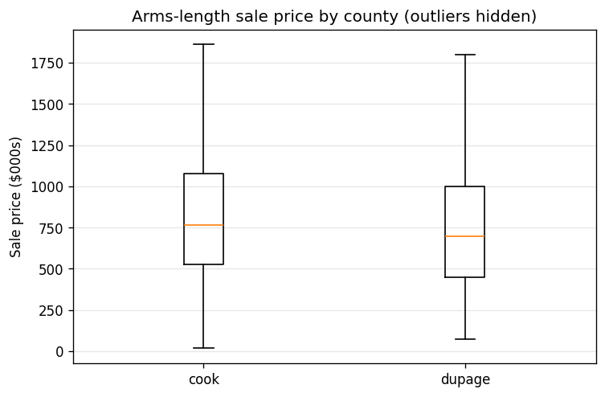

# Burr Ridge Residential Price Trends

**Run date:** 2026-05-26
**Data snapshot:** 2,203 arms-length residential sales, 2013–2025 (13 full years). DuPage County 1,763 (80%); Cook County 440 (20%). The partial in-progress year (2026) is **excluded from every trend fit** to avoid incomplete-period bias.

---

## Executive summary

- **DuPage prices are rising ~4.1%/yr** on a price-level basis (OLS log-price CAGR; 95% CI 3.0–5.2%; OLS p≈3.9e-13; Mann-Kendall increasing, τ=0.49, p=0.024). Well-powered (n=1,763, no thin years).
- **DuPage's quality-controlled appreciation is roughly double that — ~7.7%/yr** (repeat-sales, bootstrap 95% CI 5.5–10.3%, significant; n=126 resale pairs). This is the truer underlying rate; the lower median-price trend is a downward mix effect, not a contradiction (see synthesis).
- **Cook prices are rising too, but more slowly and on a thin base: ~2.0%/yr** price-level (95% CI 0.5–3.6%; p=0.010; MK τ=0.69, p=0.0012). The lower CI bound (0.5%) sits near zero, so treat single-year Cook moves as directional, not precise.
- **Cook quality-adjusted appreciation is ~4.4%/yr** (hedonic, 95% CI 3.4–5.4%, p≈2.7e-17; n=382, adj R²=0.45) — higher than its median trend, again a mix effect. Cook's repeat-sales rate (3.4%, CI 1.6–5.7%) corroborates the same direction.
- **Cross-sectionally, Cook homes sell ~10% higher** ($765K vs $695K median) — but the effect is small and the tests disagree (Mann-Whitney p=0.0004 significant; Welch t on log-price p=0.074 not significant). This is a level/mix difference, **not** an appreciation difference.

**Single most important caveat:** Cook rests on a thin base (440 sales total, as few as 18 in a year). Its confidence intervals are wide and its single-year movements are directional only. DuPage is the well-powered county; lean on it for precise statements.

---

## Per-county method note — why the strategy is asymmetric

The two counties get different primary methods because **structural-characteristics coverage differs**, and that coverage drives which estimators are valid:

- **Cook → hedonic.** Cook has 382 complete characteristics cases (sqft, beds, baths, age), clearing the ≥150 threshold, so a quality-adjusted hedonic index is viable. `lot_sqft` had poor Cook coverage and was dropped from the model.
- **DuPage → trend-test + repeat-sales.** DuPage has only 88 complete characteristics cases (below the 150 threshold), so **no DuPage hedonic is possible**. Instead DuPage leans on repeat-sales (126 pairs), which controls for time-invariant quality *without* needing characteristics — its strongest appreciation signal.
- Both counties support the price-level trend test (≥5 years) and the cross-county level comparison.

Consequence: there is **no quality-adjusted cross-county comparison** — the hedonic lane is Cook-only, so we cannot put the two counties on common quality-adjusted terms.

---

## Findings by lane

### Quality gate
2,203 arms-length sales clear the gate across 2013–2025. Three of four lanes are fully viable across both counties; the hedonic lane is constrained to Cook by DuPage's characteristics gap. One thin annual cell: Cook 2015 (n=18). DuPage's minimum annual count is 53 — no thin year.

### Price-level trend (Mann-Kendall + OLS log-price)
Both counties show statistically significant upward trends (CI excludes zero **and** Mann-Kendall p<0.05). DuPage ~4.1%/yr (CI 3.0–5.2%); Cook ~2.0%/yr (CI 0.5–3.6%, thin caveat). Median price roughly $670K→$1.0M in DuPage and $603K→$1.05M in Cook. **These are not mix-adjusted** and are reconciled against repeat-sales and hedonic below.

### Repeat-sales appreciation (quality-controlled)
Compares each property to itself across two arms-length sales, controlling for time-invariant quality (no characteristics needed). Sub-annual flips are removed via a ≥1-year holding filter. DuPage 7.7%/yr (CI 5.5–10.3%, n=126, median hold 3.3y); Cook 3.4%/yr (CI 1.6–5.7%, n=51, median hold 4.0y). Both significant; neither flagged unstable. **Selection note:** repeat-sales only covers properties that resold within the window, so it over-represents more frequently traded homes — read it as the appreciation of the resold subset, not the whole stock.

### Hedonic quality-adjusted index (Cook only)
Holding size, rooms, and age constant, Cook appreciates ~4.4%/yr (CI 3.4–5.4%, p≈2.7e-17; n=382, adj R²=0.45). Coefficient signs are sensible: building sqft strongly positive (p≈3.6e-7), age negative at ~0.8%/yr (p≈3.9e-5), bathrooms marginally positive (p≈0.049), bedrooms not significant (p≈0.50, collinear with sqft). Sample is modest, so treat coefficients as indicative. **The 2019 year-fixed-effect index point (64.8 vs ~116 neighbors) is model noise in a modest sample — it is not a real 2019 price collapse** (its year-cell has 34 obs, above the <10 artifact threshold; no thin index years flagged). Trust the continuous-year 4.4%/yr slope, not the year-FE wiggle.

### Cross-county price comparison
Cross-sectional level comparison only — **not** appreciation. Cook median $765K (n=440) vs DuPage $695K (n=1,763), so Cook is ~10% higher. The two tests disagree: Mann-Whitney U is significant (p=0.0004) but Welch t on log-price is not (p=0.074), and the effect size is small (rank-biserial −0.11). Samples are unbalanced (~4× more DuPage). Read this as a real-but-small level difference with substantial distributional overlap.

---

## Cross-lane synthesis

**The median trend understates real appreciation in both counties — this is a mix effect, not a conflict.** In DuPage, quality-controlled repeat-sales (7.7%/yr) run roughly double the median-price trend (4.1%/yr). In Cook, both the hedonic (4.4%/yr) and repeat-sales (3.4%/yr) rates exceed the median-price trend (2.0%/yr). The consistent gap means the median is being dragged down by the **mix of what transacts** — relatively cheaper homes are trading later in the window — so the median rises more slowly than any given home actually appreciates.

Reading the three rates together per county:

| County | Median-price trend | Repeat-sales (quality-ctrl) | Hedonic (quality-adj) | Take |
|---|---|---|---|---|
| DuPage | 4.1% (CI 3.0–5.2) | **7.7% (CI 5.5–10.3)** | n/a (no coverage) | Underlying ~7–8%, median understated by mix |
| Cook | 2.0% (CI 0.5–3.6) | 3.4% (CI 1.6–5.7) | **4.4% (CI 3.4–5.4)** | Underlying ~4%, median understated by mix |

For the **truer underlying appreciation**, prefer the quality-controlled rates: DuPage repeat-sales (~7.7%) and Cook hedonic (~4.4%). The cross-county level comparison (Cook ~10% pricier) is a separate, cross-sectional question and does not speak to which county is appreciating faster — on appreciation, DuPage's quality-controlled rate is the higher of the two.

---

## Limitations & QA notes

- **Incomplete-period bias** — the partial 2026 year is excluded from all trend fits; only the 13 complete years 2013–2025 are used.
- **Small-n / wide CIs (Cook)** — Cook rests on 440 sales with annual cells as low as 18 (2015). Its trend-test CI runs to a 0.5% lower bound (near zero) and the hedonic carries a modest-n caveat. Single-year Cook moves are directional, not precise. DuPage (n=1,763, min annual 53) is well-powered.
- **Selection / survivorship (repeat-sales)** — covers only properties that resold within the window; it over-represents frequently traded homes. Interpret as the resold subset's appreciation.
- **Unreliable year fixed effects (hedonic)** — the 2019 hedonic index point (64.8) is model noise, not a real price event; it is **not** narrated as a price collapse. The continuous-year 4.4%/yr slope is the reliable figure. No index year fell below the <10-obs artifact threshold.
- **Multiple comparisons** — several tests were run across lanes; marginal single p-values are treated skeptically. The clearest case is the cross-county comparison, where Mann-Whitney (p=0.0004) and Welch t (p=0.074) disagree — we lean conservative and call the level difference real but small.
- **Mix effects** — repeat-sales/hedonic rates exceeding the median trend are explained as downward mix drag on the median (above), not as contradictions.
- **Not-comparable comparisons** — the cross-county lane is a cross-sectional level/mix comparison, not an appreciation comparison, and cannot be extended to quality-adjusted (hedonic) terms because DuPage lacks the characteristics coverage.
